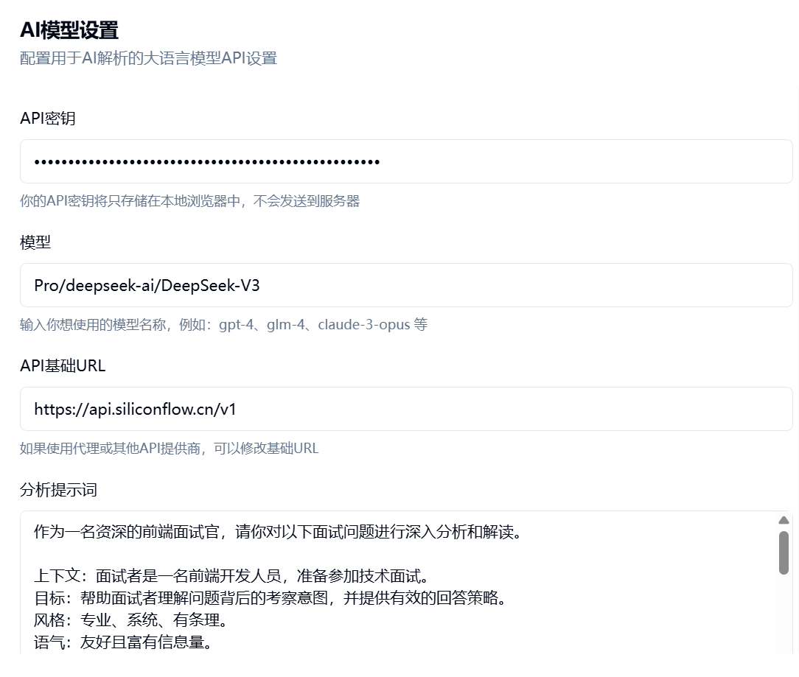

# FERusher - 切图仔，冲冲冲！

## 项目简介


FERusher 是一个专为前端开发者打造的面试题练习平台。

该项目收集了大量来自不同公司、不同面试环节的**上万道**真实面试题，并提供了多种筛选、搜索、收藏和大语言模型分析功能，帮助开发者更好地准备面试。

包括不限于阿里巴巴、字节跳动、腾讯、百度、美团、京东、滴滴、华为、小米、快手、网易、拼多多、B站、知乎、微软中国、亚马逊中国、ThoughtWorks等知名互联网公司。

## 快速链接

- **在线体验**：[https://fe.inxb.top/](https://fe.inxb.top/) - 立即访问部署网站，开始练习面试题
- **项目详解**：[https://nixiaobai.com/posts/interview-dataset/](https://nixiaobai.com/posts/interview-dataset/) - 查看详细的博客文章了解更多项目背景与实现细节

## 功能特点

- **问题浏览**：查看来自各大互联网公司的前端面试题
- **多维度筛选**：按公司、难度、分类、评分等多个维度筛选问题
- **随机题目**：支持随机抽取题目进行练习
- **收藏功能**：收藏重要问题，便于复习
- **AI分析**：集成AI功能，对面试问题进行分析和解答
- **响应式设计**：适配各种设备和屏幕尺寸
- **暗色模式**：支持明暗主题切换

## 技术栈

- **前端框架**：Next.js 15
- **UI组件**：基于Radix UI的自定义组件
- **状态管理**：React Hooks
- **样式解决方案**：Tailwind CSS
- **AI集成**：OpenAI API
- **部署**：支持静态部署

## 安装与使用

### 环境要求

- Node.js 18+ 
- pnpm 8+（推荐使用pnpm作为包管理器）

### 安装步骤

1. 克隆项目
```bash
git clone https://github.com/ni00/FERusher.git
cd FERusher
```

2. 安装依赖
```bash
pnpm install
```

3. 开发模式运行
```bash
pnpm dev
```

4. 构建生产版本
```bash
pnpm build
```

5. 启动生产版本
```bash
pnpm start
```

### 配置AI功能

如需使用AI分析功能，请在设置页面配置



## 贡献指南

欢迎提交Issue和Pull Request来帮助改进此项目。

## 许可证

MIT License 