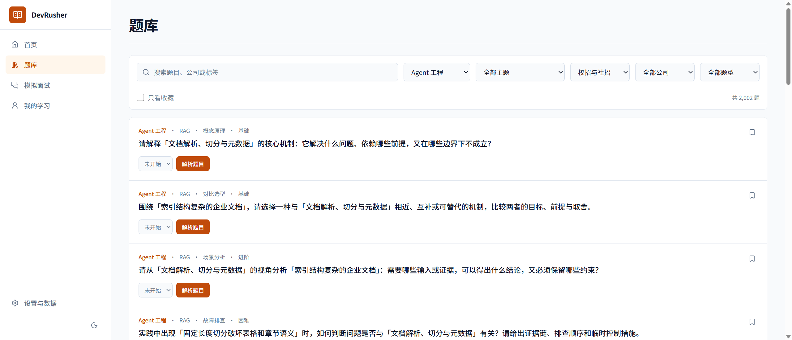
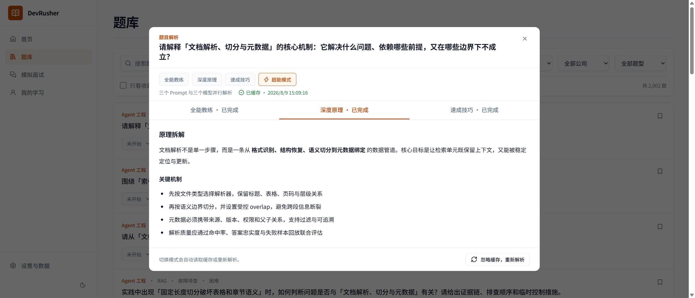
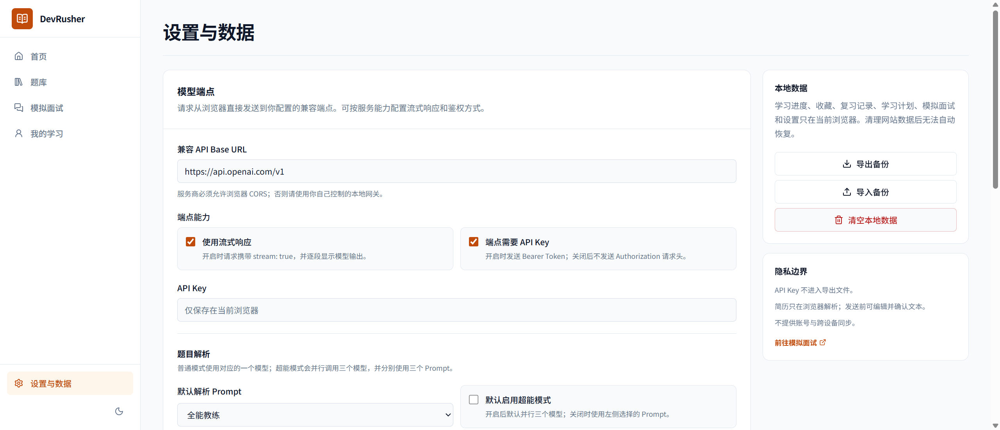

# DevRusher

DevRusher 是面向程序员校招与社招的本地优先面试学习工具，适合短期冲刺、长期刷题和模拟面试。

当前题库收录
**24,791 道题目**，覆盖计算机基础、前端、后端、移动端、质量与测试、平台与运维、大模型算法、Agent 评测和 Agent 工程九个方向。准确题量以
[题包清单](./public/content/manifest.json) 为准。

## 功能

- 按方向、主题、求职阶段、公司和题型筛选题目
- 收藏、学习状态、学习计划和间隔复习
- 单模型解析与三模型并行解析，结果自动缓存在本地
- 10 / 20 / 30 / 60 题练习和逐轮模拟面试
- PDF、Markdown、TXT 简历本地解析
- 本地保存学习进度、能力画像、面试记录和解析缓存
- 明暗主题与移动端适配







项目不提供登录或跨设备同步。API
Key 不会进入备份文件，学习数据默认只保存在当前浏览器。

## 技术栈

Node.js 26、pnpm 11.20、Next.js 16.3、React 19.2、TypeScript、Tailwind CSS
4、Vercel AI SDK 和 IndexedDB。

项目采用单体部署与模块化内核，题库、学习进度、AI、模拟面试和内容流水线各自维护边界。

## 本地开发

仅支持 Node.js 26。

```bash
pnpm install --frozen-lockfile
pnpm dev
```

常用命令：

```bash
pnpm check          # 格式、Lint、类型、测试和题包校验
pnpm build          # 生产构建
```

Vercel 使用 `Dockerfile.vercel` 以 Node.js 26 容器部署；`vercel.json`
会关闭平台的 Next.js 预设，避免进入仅支持到 Node.js 24 的常规构建运行时。

## 模型请求与隐私

开发环境通过本机同源代理转发跨域模型请求；生产环境由浏览器直连模型端点，因此端点需要支持 CORS 或提供同源网关。

模型请求不设置最大输出 Token 参数，由模型服务执行自身的原生上限。API
Key 只保存在当前浏览器，本地代理不记录密钥和模型内容。

## 题库维护

Git 只跟踪 `public/content`
中可直接部署的最终题包。采集输入、清洗结果和生成报告存放在被 Git 忽略的
`content` 目录中。

维护题库前，将 `.env.example` 复制为 `.env.local` 并填写内容模型配置：

```bash
pnpm content:clean         # 清洗临时输入
pnpm content:rewrite       # 批量改写题目
pnpm content:build         # 生成最终题包
pnpm content:release-check # 执行发布校验
```

详细流程见[题库维护说明](./content/README.md)。

## License

MIT
